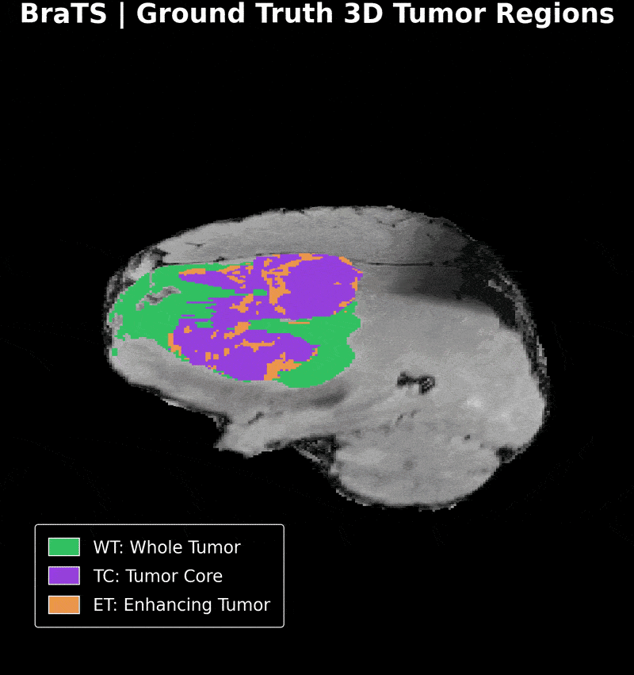
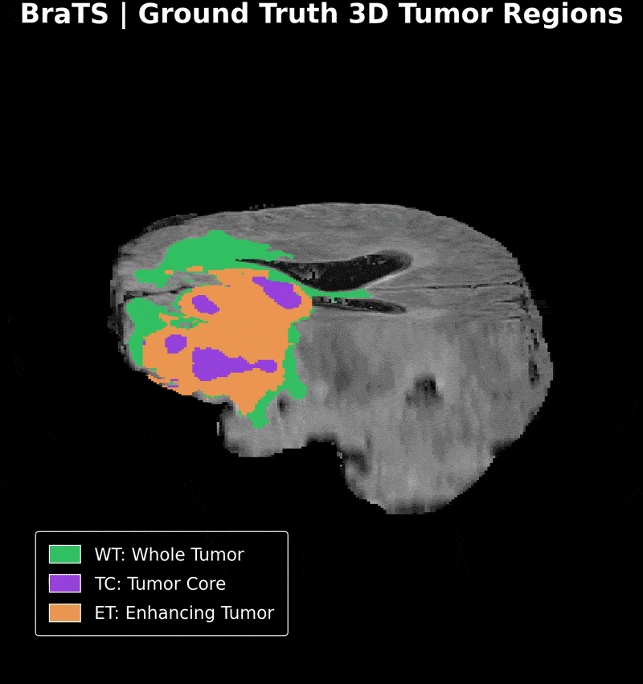
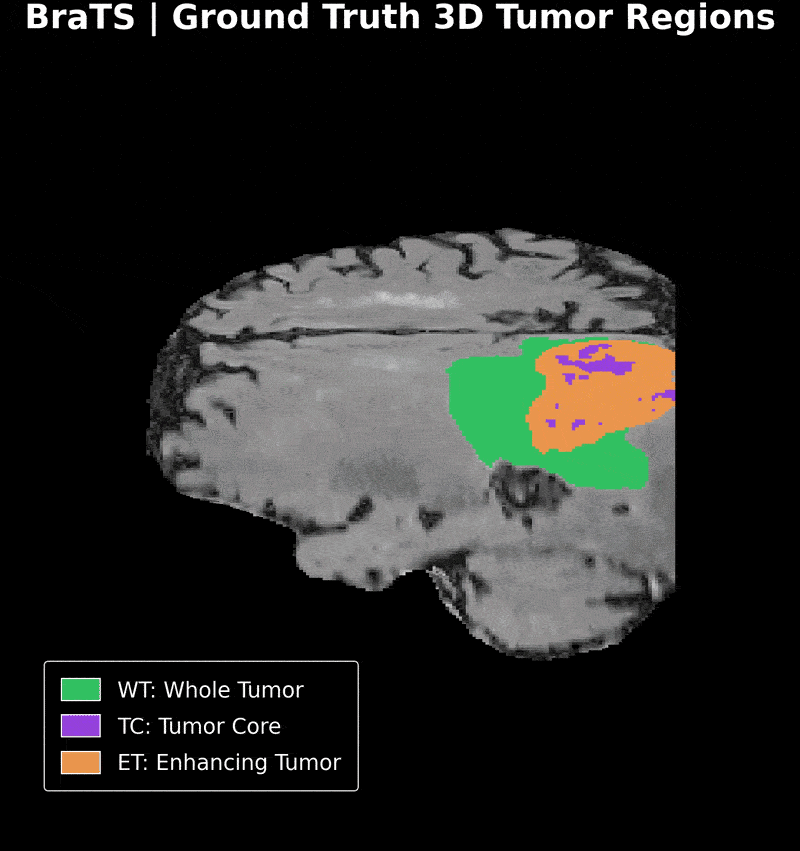
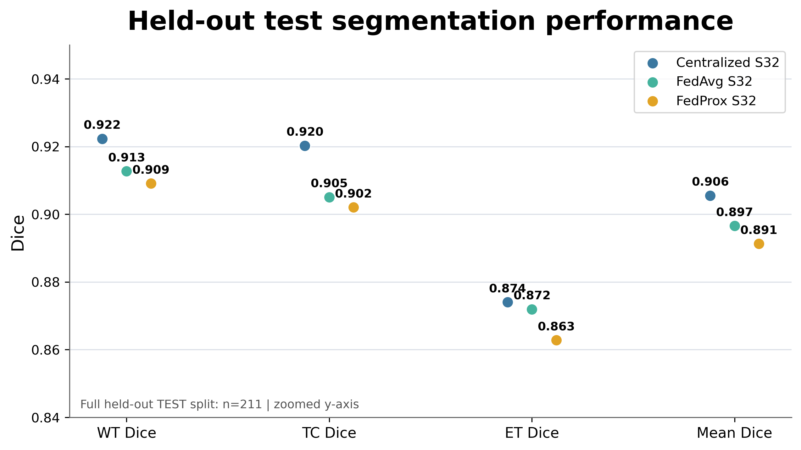
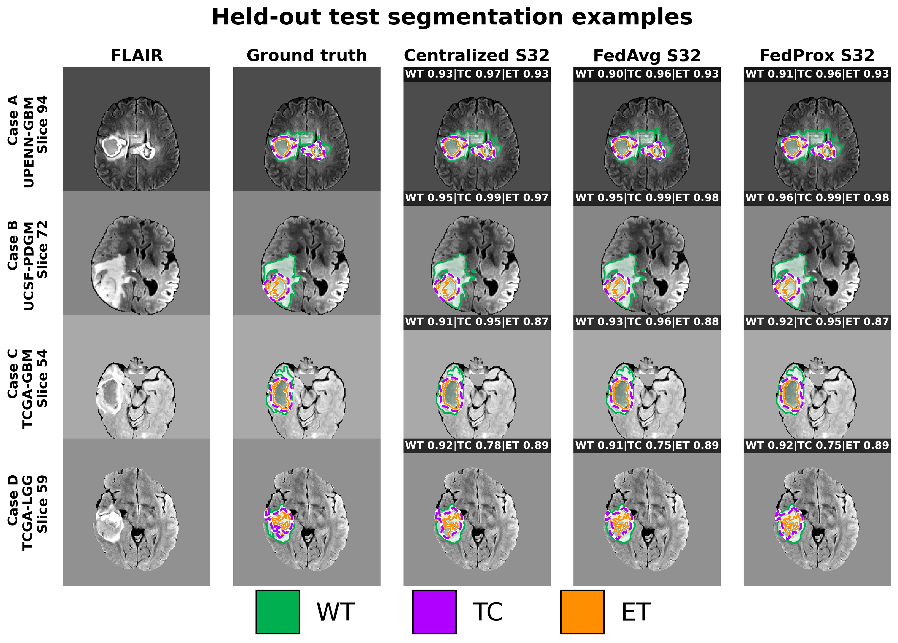
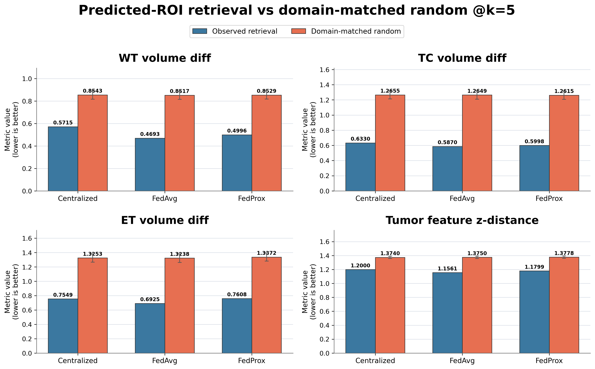

# Federated Glioma MRI Segmentation and Retrieval

This repository contains experiments for 3D glioma MRI segmentation with centralized training, FedAvg, and FedProx. The trained SegResNet encoders are also evaluated for nearest-neighbor patient retrieval using predicted tumor regions.

The project is based on four MRI modalities: **T1, T1ce, T2, and FLAIR**. Segmentation is evaluated with the standard BraTS regions **WT**, **TC**, and **ET**.

## Results
### 3D Ground Truth and Prediction Rotations

The three GIFs below show three different MRI cases. Within each GIF, the same case is rendered in sequence as:

**Ground Truth → Centralized S32 → FedAvg S32 → FedProx S32**

Each stage is shown as a full 360° 3D cutaway rotation. The colors correspond to the BraTS WT, TC, and ET regions, which makes it possible to compare the reference segmentation with predictions from the three models from multiple viewing angles.

<p align="center">
  
</p>

<p align="center">
  <em>Three MRI cases. Each GIF shows Ground Truth followed by Centralized S32, FedAvg S32, and FedProx S32 predictions.</em>
</p>

The same renderer is also used for fixed-camera Z-sweep visualizations.

### Held-out segmentation

The held-out test split contains 211 patients from four source domains.

| Model | WT Dice | TC Dice | ET Dice | Mean Dice |
|---|---:|---:|---:|---:|
| **Centralized S32** | **0.9223** | **0.9202** | **0.8740** | **0.9055** |
| FedAvg S32 | 0.9127 | 0.9051 | 0.8719 | 0.8966 |
| FedProx S32 | 0.9091 | 0.9020 | 0.8628 | 0.8913 |

<p align="left">
  
</p>

### Qualitative examples

The figure below shows one held-out case from each source domain. The columns contain FLAIR, ground truth, and predictions from the three models.

<p align="left">
  
</p>

## Patient Retrieval

For retrieval, each frozen segmentation model first predicts a full-volume mask. The predicted whole-tumor center defines a `128 x 128 x 128` ROI. Encoder feature maps are pooled and L2-normalized, then cosine similarity is used for nearest-neighbor search.

```text
MRI volume
   -> predicted WT mask
   -> WT-centered ROI
   -> frozen SegResNet encoder
   -> multiscale pooled embedding
   -> cosine top-k retrieval
```

Ground-truth masks are not used to localize the primary predicted ROI.

At `k = 5`, the observed phenotype-distance results were:

| Model | WT diff | TC diff | ET diff | Tumor-feature z-distance |
|---|---:|---:|---:|---:|
| Centralized S32 | 0.5716 | 0.6330 | 0.7549 | 1.2000 |
| **FedAvg S32** | **0.4693** | **0.5870** | **0.6925** | **1.1561** |
| FedProx S32 | 0.4996 | 0.5998 | 0.7608 | 1.1799 |

Lower values are better for these distance metrics. All three embedding models also outperformed the domain-matched random baseline on the four primary distance metrics.

<p align="left">
  
</p>

## Repository Layout

```text
.
├── assets/readme/          # images and GIFs used in this README
├── configs/                # reference experiment settings
├── docs/                   # selected generated figures, tables, and reports
├── models/                 # run configs, histories, and evaluation tables
├── notebooks/              # experiment notebooks
├── src/brats_pipeline/     # reusable pipeline code
├── tests/                  # lightweight unit tests
├── .gitignore
├── requirements.txt
└── README.md
```

Reusable code is kept in `src/brats_pipeline/`:

```text
common.py       paths, hashing, cache helpers
 data.py         NIfTI loading, labels, crops, coordinate conversion
 training.py     datasets, augmentation, losses, FedAvg/FedProx utilities
 inference.py    SegResNet loading and full-volume inference
 retrieval.py    encoder pooling, phenotype features, retrieval controls
 rendering.py    3D cutaway and Z-sweep rendering
 montage.py      PNG/video montage utilities
```

## Notebook Order

```text
01  Manifest and EDA
03  Centralized training
04  Full-volume test evaluation
05  FedAvg training
06  Model comparison
07  FedProx training

08   GT-centered retrieval reference
08b  GT-centered random controls
08c  Predicted-ROI retrieval
08d  Predicted-ROI random controls

09  Qualitative figures
10  3D cutaway rotation
11  Z-sweep
12  PNG/video montage
```

The training notebooks are separate from the full-volume test evaluation notebook so the held-out test set is evaluated after checkpoint selection.

## Setup

Create an environment and install a PyTorch build appropriate for your CPU/CUDA setup, then install the remaining dependencies:

```bash
python -m venv .venv
source .venv/bin/activate
pip install -r requirements.txt
```

If needed, set the repository root explicitly:

```bash
export BRATS_PROJECT_ROOT=/path/to/repository
```

## Data

MRI data and model checkpoints are not included in the repository.

The experiments use the **RSNA-ASNR-MICCAI-BraTS-2021** dataset hosted by The Cancer Imaging Archive (TCIA):

- Dataset: [RSNA-ASNR-MICCAI-BraTS-2021](https://www.cancerimagingarchive.net/analysis-result/rsna-asnr-miccai-brats-2021/)
- DOI: [10.7937/jc8x-9874](https://doi.org/10.7937/jc8x-9874)

The BraTS 2021 TCIA release combines data associated with several source
collections, including TCGA-GBM, TCGA-LGG, UPENN-GBM, UCSF-PDGM,
IvyGAP, ACRIN-FMISO-Brain, and CPTAC-GBM.

This project uses a four-domain subset:

- TCGA-GBM
- TCGA-LGG
- UCSF-PDGM
- UPENN-GBM

These source-domain labels are used as simulated federated clients and for
stratified evaluation.

## Tests

The lightweight tests do not require the BraTS dataset or trained checkpoints.

```bash
PYTHONPATH=src pytest -q tests
```

They cover label remapping, crop/coordinate helpers, segmentation metrics, federated aggregation, and retrieval utilities. The loss integration test requires MONAI.

## Notes

- The source domains are used as simulated federated clients and for stratified analysis.
- The retrieval stage is an image-derived nearest-neighbor experiment; it is not a longitudinal patient simulator or a clinical decision system.
- The project is intended for research and experimentation, not clinical use.


